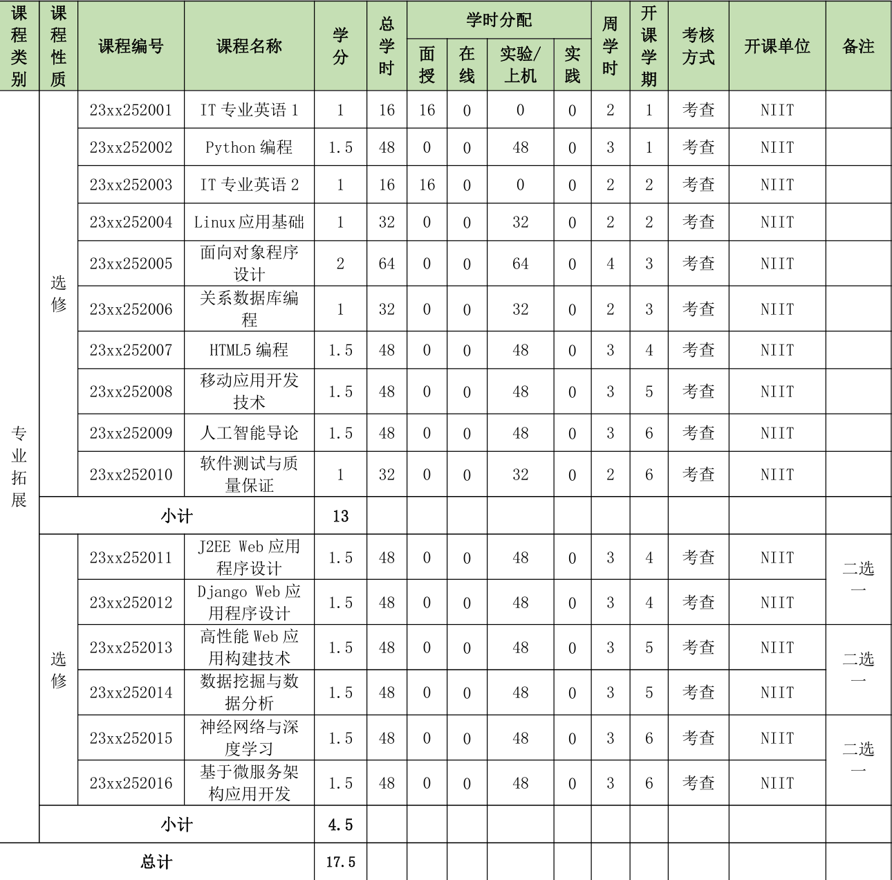

写这一篇文章时我应该正处于大二上学期，回顾一路一来在学校的学习经历，突出的就是两个字—— **迷茫**。

> 这里仅以软件工程专业的专业课为例。

其实迷茫这个词一直伴随着我，至少到现在都是这个样子的，好像周围的大家也都是这个样子的。如果不是一些额外的学习，我现在还被局限在Python，C，Java三门编程语言的小圈子里，当然不是说这些编程语言如何，而是**不知道能用它们来做什么**，也就导致了迷茫。

所以在这一篇文章里，我想为大家介绍一些东西，让大家对未来能有更好的规划。也请大家千万不要被专业之类的东西限制住了，最厉害的网安工程师可能出自于软工（某位也算是传奇的学长），最精美和最高效的软件也可能由信科的某位天才开发出来，最令人惊叹的大模型也可能是某人用4060跑一万年跑出来的。**请大家一定要相信自己能做出一番成就，不要被某些东西所限制**。