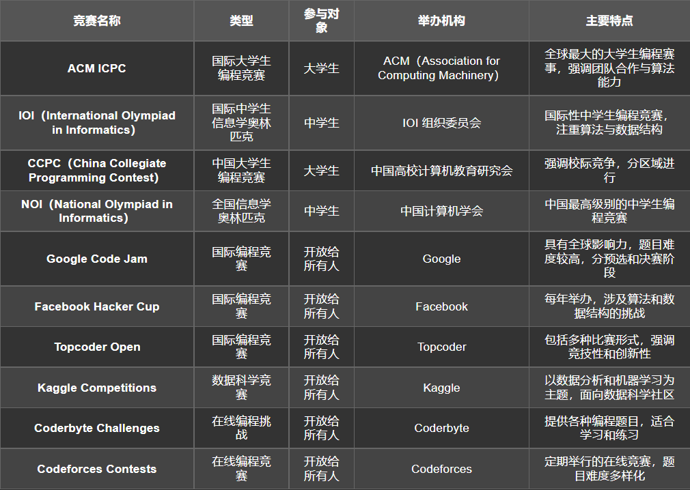

# 简介

在本手册中**OI** 指的是 **“程序设计竞赛”（Olympiad in Informatics**，而非某个具体的竞赛，也可理解为算法竞赛。

> 本章中的内容可以理解为算法、数据结构等一系列东西。大家理解即可，不用去细究概念。

# 声明

我知道一部分的同学接触过OI，甚至有人参加过相关的比赛。在刚入学的一段时间里，我同样也热衷于OI。那个时候我甚至不知道什么是OI。但是在这里非常遗憾的告诉大家，海师并不怎么发展OI。如果没有某些重大改变，你在接下来的几年里不会参加任何关于OI的专业培训，顶多会开展一些讲座。也就意味着，大家几乎完完全全要通过自学的方式来学习OI。并且大家参与不到CCPC、ICPC等含金量极高的比赛，**蓝桥杯、天梯赛**将会是大家唯二能用到OI知识的比赛。这是一条彻彻底底的不归路，如果不是真的有大毅力和顶级天赋的同学，将极难获得成就。请热衷于这一条道路的同学深思。同时由于我能力不足，这里只能为大家再次 **[指路OI-Wiki](/OI/Guide.md)**。

虽然大家无法参与到高含金量的比赛中，但是对于**算法和数据结构**的学习是绝对不能落下的。**算法**是几乎是任何人工作面试都无法逃避的部分，堪称现代计算机专业八股文。**数据结构**直接成为了考研408中的一门。希望大家有事没事多多刷题，提高自己的算法水平，**这真的非常非常重要**。