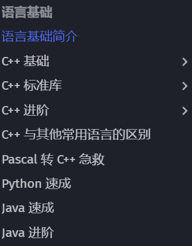
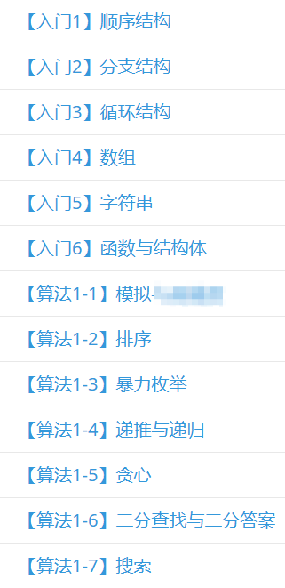

# 入门编程语言

由于培养方案的改变，现在大一新生首先接触的编程语言为 Python。但是笔者强烈建议掌握 C/C++，这样可以方便之后的各种学习，因此这篇文章仅提及 C/C++。

上图来源 [**OI-Wiki语言基础**](https://oi-wiki.org/lang/) ，从图中可以看出，使用 C++作为第一门学习的语言可以速成很多语言。~~甚至不学 C++需要急救~~

## 零基础入门

* [**菜鸟教程 C++教程**](https://www.runoob.com/cplusplus/cpp-tutorial.html)
* [**OI-WiKi 语言基础**](https://oi-wiki.org/lang/)
* [**C++在线编辑器**](https://www.runoob.com/try/runcode.php?filename=helloworld\&type=cpp)
* [**Dev-C++：适合初学者的 IDE**](https://sourceforge.net/projects/orwelldevcpp/)

## 具有一定基础

推荐以上图的顺序进行学习（难度不小）。**[指路 => 洛谷题单广场](https://www.luogu.com.cn/training/list)**